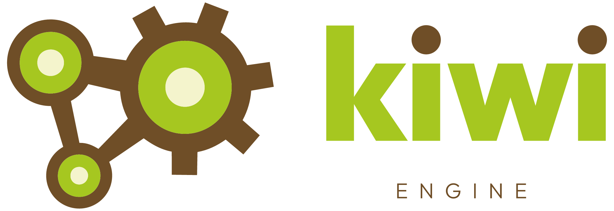

Welcome to the Kiwi Engine documentation.

This documentation serves two purposes. First, it helps me quickly recall the structure and design of systems I haven’t worked on in a while. Second, it functions as regular technical documentation for the engine.

Since this is a solo, learning-focused project, I prioritize clarity and context over brevity. Some sections may go deeper into implementation details than strictly necessary to fully document design decisions and internal behavior.

# Platforms and Compilers Support
The only platform currently supported is Windows. This could change in the future, but the current focus in on the tech itself. The platform layer is self contained and accessed through a unified API, making it invisible to the rest of the engine.

The primary compiler supported is MSVC with permissive mode disabled (`/permissive-`) in order to enforce standards-conforming compiler behavior. Support for additional compilers will be introduced later to allow performance comparison. See the [[build_system]] page for details about the build system and instructions.

# High Level Engine Overview