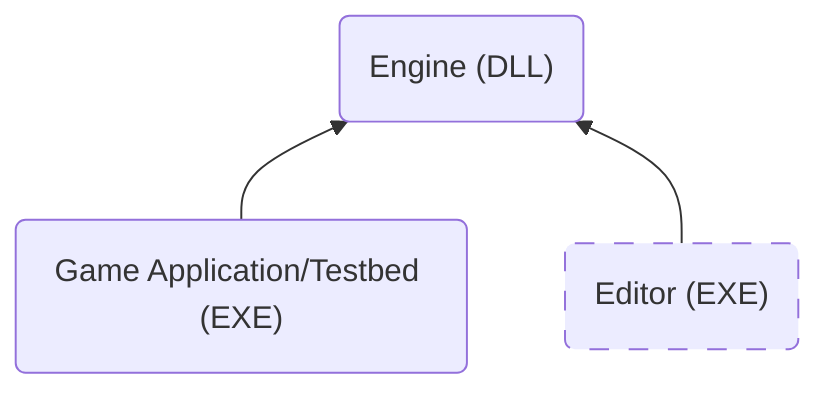

Welcome to the Kiwi Engine documentation, a 3D game engine.

This documentation serves two purposes. First, it helps me quickly recall the structure and design of systems I haven’t worked on in a while. Second, it functions as regular technical documentation for the engine.

Since this is a solo, learning-focused project, I prioritize clarity and context over brevity. Some sections may go deeper into implementation details than strictly necessary to fully document design decisions and internal behavior.

# Platforms and Compilers Support
The only platform currently supported is Windows. This could change in the future, but the main focus of the project in on the tech itself.

The platform layer is self contained and accessed through a unified API, making it invisible to the rest of the engine.

The primary compiler supported is MSVC with permissive mode disabled in order to enforce standards-conforming compiler behavior and improve code portability. Support for additional compilers will be introduced later to allow performance comparisons and test. See the [[Build System]] page for details and step by step instructions.

# High Level Engine Architecture
The engine is built as a DLL (or multiple DLLs later in development) that the game application (`.exe`) links against. The repository includes a dummy game called Testbed, used to test each feature as the engine evolves.

Later in development, an editor application will be added. It is intended to run alongside the game and will link against the engine as well. Keeping the editor separate from the engine core avoids shipping editor code with the game.

# Feature List
The following is a list of features and system implemented.

> [!info]
> Documentation for most elements in the following lists is still work in progress!

- **[[Windows Platform Layer]]:** Provides APIs for windowing, memory allocation, console output and time.
- **[[Rendering]]:** Rendering system using Vulkan.

## Core
- **[[]]:**

## Containers
- **[[]]:**